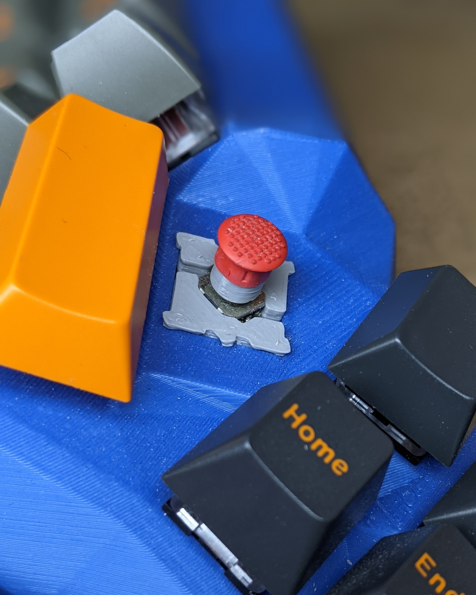
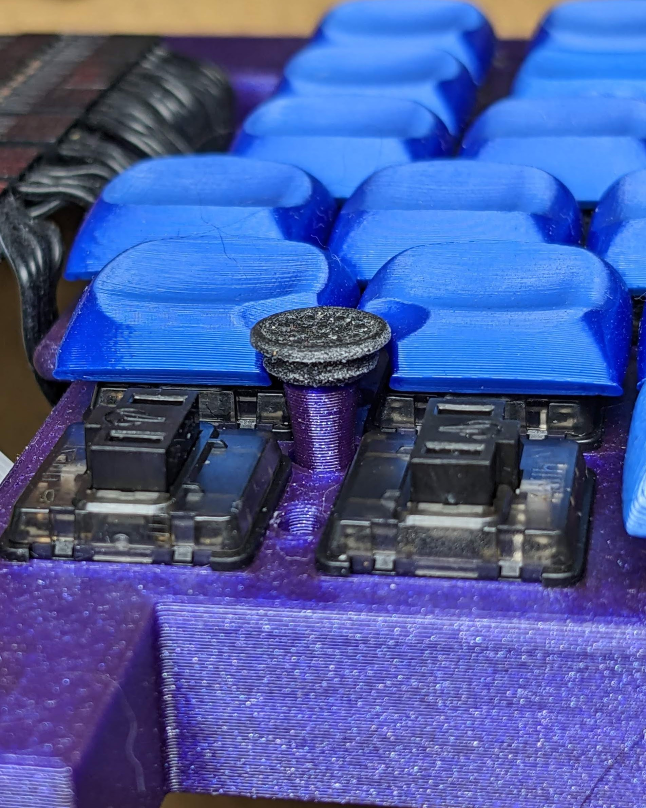
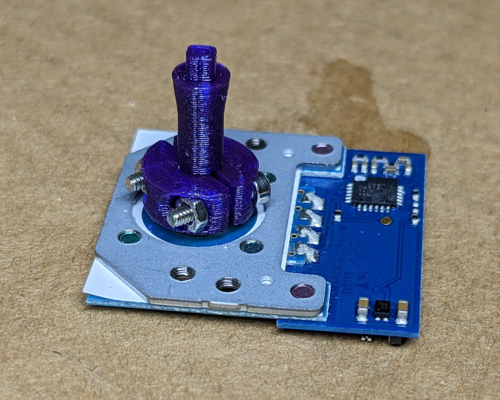
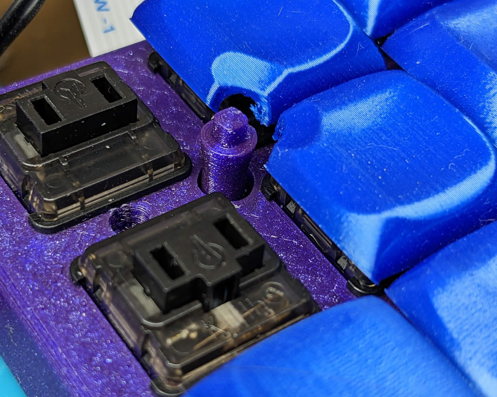
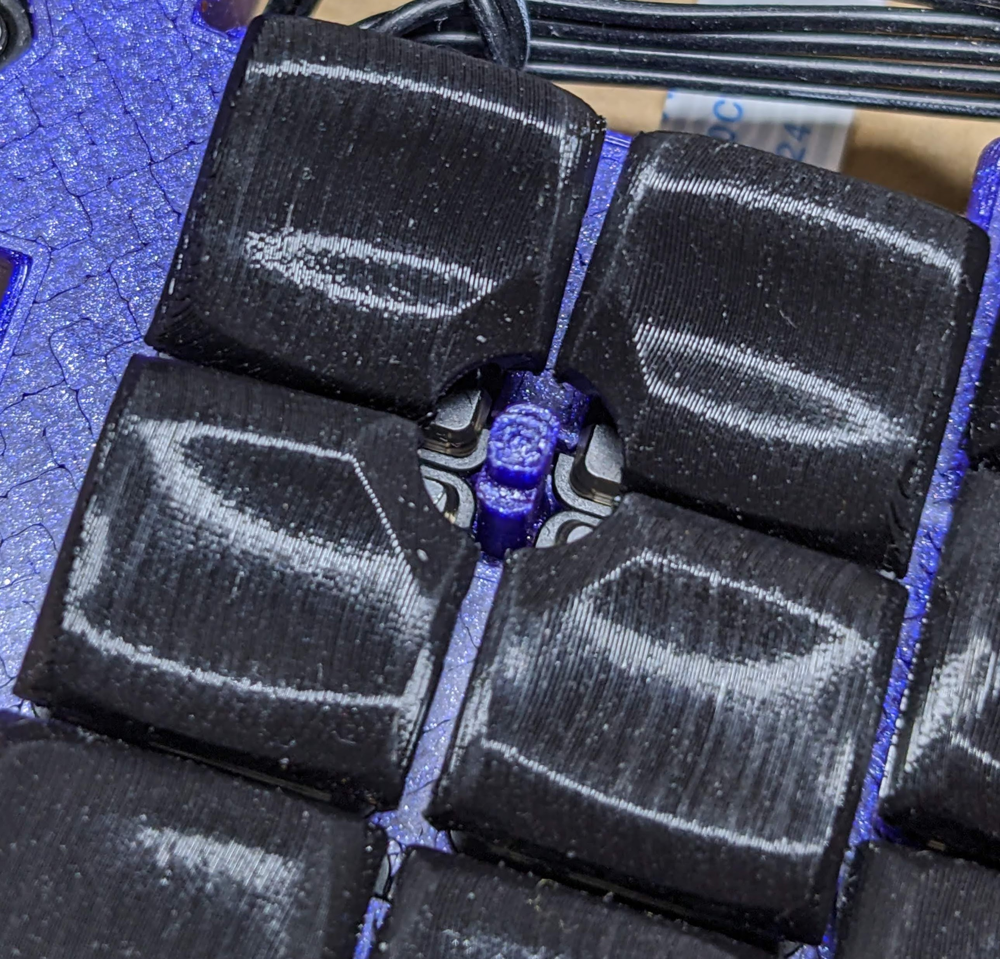
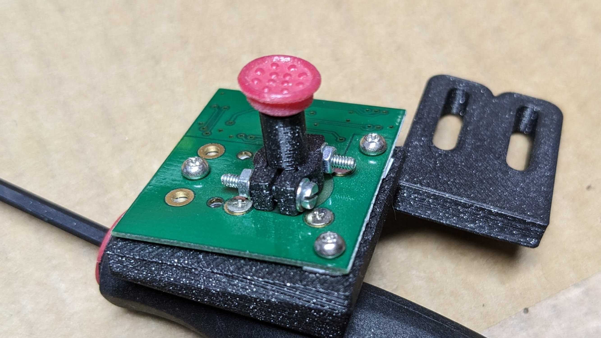

# Trackpoint Stem Extensions, and Navigation Switch Keycaps and MX Switch Mount Adapters

<!--
both 4:5
 
 
Trackpoint | Nav
:---:| :---:
 | 
-->

 

<!-- markdown-toc start - Don't edit this section. Run M-x markdown-toc-refresh-toc -->
**Table of Contents**

  - [Trackpoint Stem Extensions](#trackpoint-stem-extensions)
    - [See Also](#see-also)
    - [Discontinued](#discontinued)
  - [Navigation Switch Keycaps and MX Adapters](#navigation-switch-keycaps-and-mx-adapters)
  - [Usage](#usage)
  - [Printer Settings](#printer-settings)
    - [Trackpoint Stem Extensions](#trackpoint-stem-extensions-1)
    - [Old Advice for Nav Caps](#old-advice-for-nav-caps)
  - [Comparison of Supported Nav Switches](#comparison-of-supported-nav-switches)
    - [SKQU - The Classic 10x10 mm 5-way Nav Switch](#skqu---the-classic-10x10-mm-5-way-nav-switch)
    - [Datasheet](#datasheet)
      - [Wiring](#wiring)
      - [Operating Force](#operating-force)
    - [SKRH - The Replacement](#skrh---the-replacement)
    - [Datasheet](#datasheet-1)
      - [Wiring](#wiring-1)
      - [Operating Force](#operating-force-1)
    - [RKJXS - The 8-way Upgrade](#rkjxs---the-8-way-upgrade)
    - [Datasheet](#datasheet-2)
      - [Wiring](#wiring-2)
      - [Operating Force](#operating-force-2)

<!-- markdown-toc end -->

## Trackpoint Stem Extensions

The recommended model for modern trackpoint sensors with 2.5 mm x 2.5 mm square stems for "super low profile" or newer rubber caps is `trackpoint-lp-clamp-aio-platform`. This compact stem fits over the trackpoint stem and then clamps diagonally using two M1.6x8 screws and M1.6 hex nuts (with M1.6x6 it is a bit hard to catch the nut). The hex holes hold the nut in place while tightening. The platform flares out to support the bottom of the rubber dome, which increases responsiveness. The clearance required for the clamp is a cylinder above the trackpoint sensor with 5 mm height and 13 mm diameter.

You can limit the width of the platform so it fits through your PCB and/or switch plate by changing the value of `max_dia` in `stems/trackpoint-lp-clamp-aio-platform.scad`. Or use the non-platform variant `trackpoint-lp-clamp-aio` for a narrower stem, which can itself be controlled by changing the value of `stem_dia`. I generally use a 5 mm hole for the stem in my keyboard plate for the default 4 mm `stem_dia` and 4.9 `max_dia`. `stem_dia` needs to have clearance for the stem's movement, along with possible off center or angled mounting. `max_dia` just needs to fit through.

For a build with minimum Y spacing between switches, `trackpoint-lp-clamp-aio-platform-narrow` trades a little rigidity for tight key spacing, allowing 15 mm spacing in Y and 17.6 mm in X. You can achieve 15mm X spacing by offsetting the keycap stems by 1.3 mm on each side. I have used this with a 2.7 mm x 6 mm rectangular hole in my keyboard plate.

For a trackpoint sensor with a round stem, such as on the Sprintek 8707-51, `sprintek51-clamp-aio` is available.

If space is not at a premium and you want a firm hold with washers and lock washers, use the non-aio variants, `trackpoint-lp-clamp` and `sprintek51-clamp`. Minimum screw length is M1.6x8. I have not found this to be necessary in practice.

If necessary, make sure to tune the `vertical_slop` so that you can see the trackpoint stem underneath the clamp (i.e. the clamp is not resting flat on the trackpoint sensor, but instead resting on the top of the trackpoint stem and held off the surface of the sensor). This will help prevent force on the top of the extension from levering the trackpoint stem and breaking it off (if this does happen, it is possible to superglue the stem back into place but it should be avoided).

It is important to make sure you have the correct setting for `keycap_style` as the rubber cap's height is subtracted from `effective_height` to determine the actual height of the stem generated. If you are having difficulty measuring your keyboard, a 16 mm `effective_height` is a good starting place for lower profile keyboards, such as those using unsculpted keycaps or choc switches. 20 mm for a high profile keyboard such as those with SA keycaps on MX switches.

`keycap_style` | Height 
---|---
`trackpoint-lp` | 5 mm
`trackpoint-slp` | 4 mm
`trackpoint-3_5` | 3.5 mm
`trackpoint-3` | 3 mm

### See Also
* [SaotoTech's Trackpoint Cap Comparison](https://saoto28.wixsite.com/trackpoint4life/comparison): to figure out what cap type to put in `settings.scad`.
* [Printed Keycap Mods](https://github.com/wolfwood/printed-keycap-mods): my 3D printed keycap generator with trackpoint notch support
* [Try-a-Dactyl](https://github.com/wolfwood/tryadactyl): my 3D printed keyboard generator with trackpoint support

### Discontinued
The `trackpoint-lp-square` stem extension is a suspended effort, as I had difficulty obtaining a press-fit that will not rock on at least one axis. I stopped working on it as I found, at least with the Sprintek trackpoint modules, **removing a press-fit stem extension can rip the trackpoint stem off of the sensor, so proceed at your own risk!** If you do suffer this fate, you can try supergluing the stem back on. If you are committed to this path, your best bet is probably using [series.scad](series.scad) to print a variety of sizes at once and possibly tweaking the corner cutouts if you see rounding of the corners that interferes with insertion (or if the corner cutouts are too large and you get rounding of the sides of the hole).

## Navigation Switch Keycaps and MX Adapters
The project has functional MX adapters and stems that fit the SKQU and SKRH nav switches described below, and 'keycaps' for using a trackpoint rubber cap.

There are also a variety of purely 3D-printed keycaps, in a variety of shapes: cup, saddle, bar, banana (maybe I should have called it macaroni?), dome and cup with a 'chin' which is meant to be used at an angle with the chin providing extra material to press down/towards the user. Right now I think the trackpoint is the most comfortable; everything else should be considered a work in progress, but the dome (basically a less-good trackpoint) and banana show the most promise. Sheet versions of the cup and saddle are thinner and less likely to bump into adjacent keys, but the plain versions are cool too.

The RKJXS adapter (and stem) exist but are not quite useable in current form. The adapter in particular is challenging because the switch is very large and the adapter walls become very narrow, to the point that the slicer ignores them.

## Usage
First, edit `settings.scad` to select a `stem_model` and `keycap_style` from among those available in `stems/` and `keycaps/` respectively. Edit others settings as appropriate, the main one of interest is `effective_height`; measuring the height of adjacent keys from the switch plate will provide a good starting place. All distances are in millimeters.

Next, run `make update`. This is necessary anytime you edit `stem_model` or `keycap_style` because openscad only allows string literals in imports, so we import a symlink, maintained by `make`, that points to the appropiate files. You will also need to manually initiate a preview or render once in any running openscad window as it doesn't watch the symlinks for changes.

You can then open the the stem in openscad to look at the result, or `openscad final.scad` to see the high quality render (may take several minutes to complete if using an old version of OpenSCAD). If you are happy with the result you can use export, or run `make` to generate an `.stl` for slicing. 

For nav switches, run `make adapter` to get the MX switch socket adapter for the switch matching `stem model`.

## Printer Settings

### Trackpoint Stem Extensions
With Prusament PLA and a Prusa MK4S I have made very rigid and accurate parts, which are more than sufficient for the task. 

I would avoid using PLA Silk or TPU, but I have had successful prints with other rigid materials that are not typically suited to fine details, like PC-CF. Very little material is used (~1 g) so it's worth using a quality filament brand.

Standard 0.2 mm layer height with a 0.4 mm nozzle works great. Use 4 perimeters and rectilinear infill (or honestly you can set infill to 0%). No support is needed, but it can be used e.g. when printing the stem extension at the same time as a keyboard.

Always print at least two extensions, or something else taller than the extension. Lone trackpoint stem extensions may get melty and deformed toward the top, printing several at once will cause the hot end to move far enough away for each layer to cool before the next.

### Old Advice for Nav Caps
* print keycaps at a 45 degree angle for a nicer surface against your finger (this may make the stem fit against the switch worse)

* print "external perimeters first" to get better dimensional accuracy for both keycap stems and MX adapters

* disable supports for bridging, so that the hole for the switch stem isn't plugged by support material

* you might get a better fit against the switch printing upside down (no elephant foot on the first few layers making things too tight)

* don't decrease layer height expecting prints to better fit the switch stem; X-Y accuracy isn't dependent on layer height, and bridges of thinner layers sag more, plugging up the switch hole in a stem

## Comparison of Supported Nav Switches

### SKQU - The Classic 10x10 mm 5-way Nav Switch

**[r/ErgoMechKeyboards](https://www.reddit.com/r/ErgoMechKeyboards/)** has coalesced around these, particularly due to the excellent modelling work and infographic by *[u/HellMoneyWarriors](https://www.reddit.com/user/hellmoneywarriors/)* found [here on thingiverse](https://www.thingiverse.com/thing:3958026), through-hole contacts, and easy availability from [Adafruit](https://www.adafruit.com/product/504) and others. Turns out these are all roughly the same regardless of manufacturer; clones of an obsoleted ALPS part, SKQU.

### Datasheet
[Datasheet](https://cdn-shop.adafruit.com/datasheets/SKQUCAA010-ALPS.pdf)

#### Wiring
There is one pin for each of the 5 switches and one common pin.
Because its possible to activate up to 3 switches at once (2 adjacent directions and 'down') integrating this switch with a keyboard matrix will require diodes on all switch pins.

For example if using QMK `config.h` setting `DIODE_DIRECTION ROW2COL` and connecting a switch pin to each row, with the common pin as a unique column, diodes should have the stripe facing toward the switch.  If using `DIODE_DIRECTION COL2ROW` with switch pins connected to rows and common as a new column, then diodes should face away from the switch.

#### Operating Force
At roughly 160 gf depending on vendor, more than triple the regular keyswitches I use, these can be quite straining on the thumbs. However the force required varies with the stem length, so putting a tall keycap on these can reduce the effort.

1.57+0.39-0.69 N operating force at 8.77 mm (10 mm minus 1.23 mm to center of stem rotation), reported. 
**141 gf·cm** (**13.8 mN·m**) calculated normalized force (divide value by actual stem length, including internal to the switch, to determine effective force).

### SKRH - The Replacement

The compact ALPS SKRH family is the manufacturer recommended replacement for the obsoleted SKQU. Longer operating life, lower operating force and smaller footprint should all make this switch an obvious improvement. Unlike the SKQU it doesn't sit flat, but has a protrusion under the stem and optional guide bosses depending on the part number.

### Datasheet
[Datasheet](https://tech.alpsalpine.com/prod/e/pdf/multicontrol/switch/skrh/skrh.pdf)
There are [kicad footprints for this switch here](https://github.com/crides/kleeb/tree/master/switch.pretty), although I haven't tested them personally.

#### Wiring
This is a surface mount part, so soldering may be more challenging, but I was able to do it. Put flux on the contacts and tin both the wires and the contacts before attempting to solder. Keep wires very short to make sure the solder joints won't collide with the MX adapter.

The pinout is not the identical to the SKQU, but there are still 6 contacts.

#### Operating Force
1.2±0.69 N operating force measured at 4.3 mm from base of switch, meaning 3.71 mm stem height ( 4.3 mm minus .49 mm to center of stem rotation), reported. 
**46 gf·cm** (**4.5 mN·m**) calculated normalized force.

### RKJXS - The 8-way Upgrade

Unfortunateky, the ALPS RKJXS has also been obsoleted.

### Datasheet
[Datasheet](https://tech.alpsalpine.com/prod/e/pdf/multicontrol/switch/rkjxs/rkjxs.pdf)

#### Wiring
This is a surface mount part, so soldering may be more challenging.

This switch has 6 contacts, ignoring the 2 `E` terminals which are not electrically connected. However, with this switch any activation connects the `P` (Push) and `C` (Common) contacts, as well as 1-2 directional contacts if pushed in a cardinal direction or diagonal.  This means that the `P` contact cannot be used alone to detect a push as with the previous 2 switches. Instead, either hardware or software must evaluate all the pins with the following expression: `Push = AND(P, NOR(1, 2, 3, 4))`.

#### Operating Force
0.8±0.5 N at < 4.15 mm stem height (4.45 mm minus ??? mm to center of rotation; must be at least 0.3 mm since that is the travel of the push button), reported. 
**< 34 gf·cm** (**< 3.3 mN·m**) calculated normalized force.
